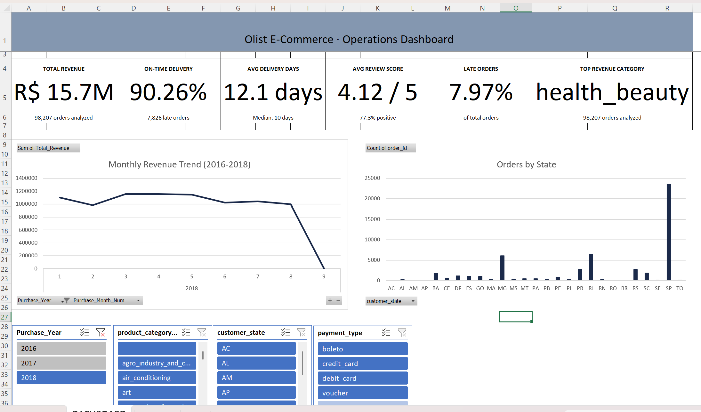
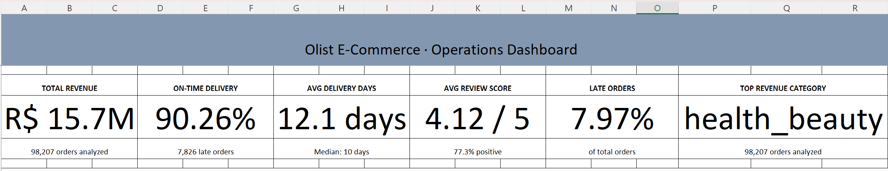
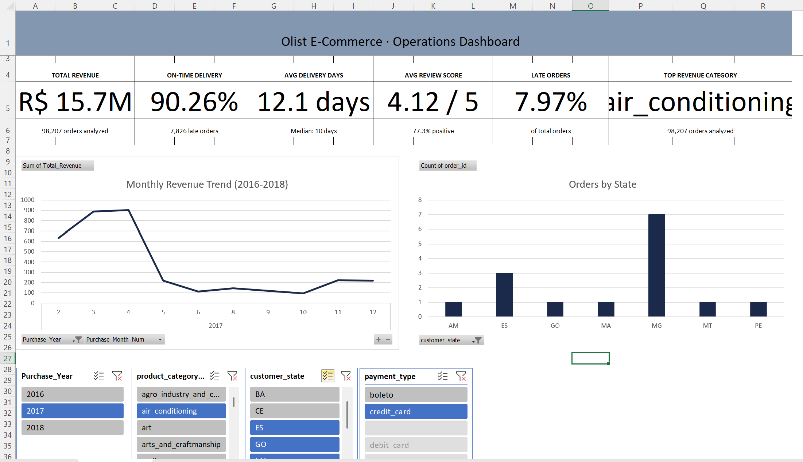

<div align="center">

# 🛒 Olist E-Commerce Operations Dashboard

### Turning 9 messy relational tables into a dashboard a business team can actually use on Monday morning.

[](https://python.org)
[](https://pandas.pydata.org)
[](https://microsoft.com/excel)
[](https://matplotlib.org)
[](.)

</div>

---

## 📌 What This Is

I took 9 messy relational tables from a real Brazilian marketplace, built a Python pipeline to clean and merge them, and turned **98,207 orders** into an interactive Excel dashboard that actually answers operational questions — delivery performance, revenue trends, customer satisfaction, and where the platform is quietly losing value.

---

## 📊 Dashboard Preview

### Full Dashboard View


### KPI Cards — Live Metrics from 98,207 Orders


### Interactive Slicers in Action


> 📥 **[Download Olist_Ops_Dashboard.xlsx](Olist_Ops_Dashboard.xlsx)** to explore the live dashboard — click any slicer and watch every chart and KPI update in real time.

---

## 🔢 The Numbers at a Glance

| Metric | Value |
|--------|-------|
| 📦 Orders Analyzed | 98,207 |
| 📁 Source Tables Merged | 9 relational CSVs |
| 📐 Final Dataset | 98,207 rows × 31 columns |
| ⏱ Date Range | Sep 2016 – Oct 2018 |
| ✅ On-Time Delivery Rate | 91.89% |
| ⭐ Avg Review Score | 4.12 / 5 |
| 💰 Total Platform Revenue | R$ 15.7M |
| 🏆 Top Revenue Category | Health & Beauty (R$ 1.44M) |

---

## 🔍 What I Found

These aren't just numbers — they're the kind of findings that change operational decisions.

**📍 São Paulo runs the marketplace, but has a satisfaction problem**
SP accounts for 41,127 orders — 42% of the entire platform. But its average review score sits below MG and PR, which process a fraction of the volume. At that scale, even small logistics inefficiencies compound fast.

**⚠️ Late deliveries don't just annoy customers — they crater ratings**
Orders that arrived late averaged **2.57 / 5** in reviews. On-time orders averaged **4.29 / 5**. That's a 40% satisfaction gap driven entirely by whether the package showed up when promised. Pearson r = -0.36 across 96,000+ delivered orders.

**🏆 Health & Beauty is quietly the most valuable category**
It generated R$1.44M — 11% more than watches & gifts in second place, and nearly 2× bed & bath. Lower-than-average late delivery rate explains the strong review scores too.

**🚨 Electronics is a risk category**
9.85% late delivery rate — nearly **double** the platform average of 7.97%. Combined with the review score correlation, this category is bleeding customer trust at scale.

**📈 The platform grew 3,700× in 14 months**
From 2 orders in September 2016 to 7,423 in November 2017. Late delivery rates climbed during the steepest growth periods — a classic sign of logistics capacity not keeping up with demand.

**💳 Credit card users are the highest-value customers**
74% of orders use credit card, with an average basket of **R$166.61** vs R$144.69 for boleto. If you're growing revenue per order, the credit card segment is where to focus.

---

## 🏗️ Architecture

```
Raw Data (9 CSVs)
      │
      ▼
┌─────────────────────┐
│   etl_pipeline.py   │  ← Cleans, transforms, merges all 9 tables
│   Python + pandas   │    Calculates 12 operational KPI columns
└─────────────────────┘
      │
      ▼
  tbl_analytics.csv       ← 98,207 rows × 31 columns
  tbl_dates.csv           ← 791-row date dimension table
      │
      ▼
┌──────────────────────────────┐
│  Olist_Ops_Dashboard.xlsx    │  ← Interactive Excel Dashboard
│  • 6 Live KPI Cards          │     Power Query + PivotTables
│  • Revenue Trend Chart       │     XLOOKUP + Slicers
│  • Orders by State Chart     │     Conditional Formatting
│  • 4 Interactive Slicers     │
└──────────────────────────────┘
```

---

## 📁 Project Structure

```
ecommerce-operations-dashboard/
│
├── 📜 etl_pipeline.py           # Full ETL — loads & merges 9 CSVs → tbl_analytics.csv
├── 📜 data_quality_report.py    # Null audit, outlier detection, value counts
├── 📜 insights_preview.py       # 10 business insight charts → /charts
├── 📜 build_date_table.py       # Date dimension table → tbl_dates.csv
│
├── 📋 requirements.txt          # Python dependencies (pinned versions)
├── 📊 tbl_analytics.csv         # Final merged analytics table
├── 📅 tbl_dates.csv             # Date dimension table
│
├── 📗 Olist_Ops_Dashboard.xlsx  # Interactive Excel dashboard
│
├── 🖼️ dashboard_overview.png    # Full dashboard screenshot
├── 🖼️ dashboard_kpis.png        # KPI cards screenshot
├── 🖼️ dashboard_filtered.png    # Slicers in action screenshot
│
├── 📁 charts/                   # 10 dark-theme insight charts (PNG)
├── 📄 insights_preview.txt      # Written findings from analysis
└── 📄 data_quality_summary.txt  # Data quality report output
```

---

## ⚙️ How to Run

**1. Clone the repo**
```bash
git clone https://github.com/AdarshKalakonda/ecommerce-operations-dashboard.git
cd ecommerce-operations-dashboard
```

**2. Download the dataset**

Go to [kaggle.com/datasets/olistbr/brazilian-ecommerce](https://www.kaggle.com/datasets/olistbr/brazilian-ecommerce) and place all 9 CSV files in the project folder.

**3. Set up the environment**
```bash
python -m venv venv
venv\Scripts\activate          # Windows
source venv/bin/activate       # Mac/Linux

pip install -r requirements.txt
```

**4. Run the pipeline — in this order**
```bash
python etl_pipeline.py          # ~60 sec — creates tbl_analytics.csv
python data_quality_report.py   # Creates data_quality_summary.txt
python insights_preview.py      # Creates 10 charts in /charts/
```

**5. Open the dashboard**

Open `Olist_Ops_Dashboard.xlsx` in Excel → Data tab → **Refresh All**.

---

## 🛠️ Tech Stack

| Layer | Tools |
|-------|-------|
| Data Processing | Python 3.14, pandas, numpy |
| Visualization | matplotlib, seaborn |
| Dashboard | Microsoft Excel 2021 |
| Excel Features | Power Query, PivotTables, XLOOKUP, Slicers, Conditional Formatting |
| Version Control | Git, GitHub |

---

## 📚 Dataset

[Brazilian E-Commerce Public Dataset by Olist](https://www.kaggle.com/datasets/olistbr/brazilian-ecommerce)
Released under CC BY-NC-SA 4.0 · Real anonymized transaction data from 2016–2018

---

## 👤 About

Built by **Adarsh Kalakonda** — this project was designed to demonstrate end-to-end data work, from wrangling raw relational tables to building a dashboard that surfaces real business insights. Every number in this README came from the actual data.

---

<div align="center">

⭐ If this project helped you, consider giving it a star!

</div>
